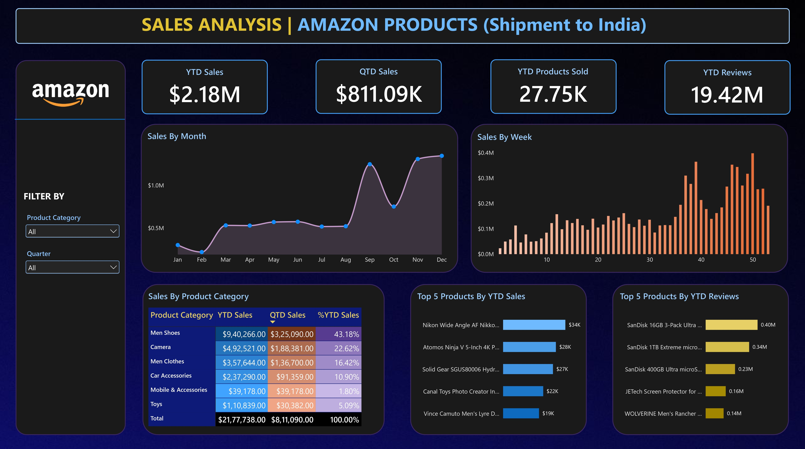

<p align="center">
  
</p>

# 📊 End-to-End Data Analysis using Power BI
### Amazon Sales Data Analysis (Shipment to India)


---

## 🎥 Project Walkthrough


---

## 📌 Project Overview

Data only creates value when it leads to decisions. This project is a complete, end-to-end analysis of **Amazon Sales Data (Shipment to India)** built in **Microsoft Power BI**.

It starts with understanding the client's requirements, moves through **Exploratory Data Analysis (EDA)**, data cleaning and data modelling, and ends with an **interactive dashboard** that tracks the KPIs and charts the client asked for.

**Why this matters**

- **EDA** exposes null values, bad date formats and hidden patterns before they break your KPIs.
- **Data visualization** turns thousands of rows into trends that can be read at a glance.
- **Power BI** lets you connect, transform, model and visualize in a single tool.

---

## 🖼️ Dashboard Preview

<!-- Add your final dashboard screenshot at assets/dashboard.png, or drag and drop the image here -->



*Final interactive dashboard: KPI cards, trend charts, category grid, Top 5 charts and slicers.*

---

## 🎯 Problem Statement

The client wants to monitor Amazon sales performance in India using a dynamic dashboard.

### KPI Requirements

| KPI | Purpose |
|---|---|
| **YTD Sales** | Monitor year-to-date sales to gauge the overall revenue performance over time. |
| **QTD Sales** | Track quarterly sales figures to identify sales trends and fluctuations. |
| **YTD Products Sold** | Analyse the total number of products sold throughout the year to understand product movement. |
| **YTD Reviews** | Keep tabs on year-to-date product reviews to assess customer feedback and satisfaction. |

### Chart Requirements

| Chart | Purpose |
|---|---|
| **Sales by Month** (Line Chart) | Visualize sales trends over time on a monthly basis to identify seasonal patterns and growth trends. |
| **Sales by Week** (Column Chart) | Display sales data on a weekly basis to pinpoint shorter-term fluctuations and performance insights. |
| **Sales by Product Category** (Text/Heat Map) | Utilize a text or heat map visualization to provide a high-level overview of sales across different product categories. |
| **Top 5 Products by YTD Sales** (Bar Chart) | Highlight the top-performing products based on year-to-date sales to focus on key revenue generators. |
| **Top 5 Products by YTD Reviews** (Bar Chart) | Identify the top-rated products by year-to-date reviews to understand customer preferences. |

---

## 🗂️ Dataset

| Property | Details |
|---|---|
| **Name** | Amazon Sales Data (Shipment to India) |
| **Main table** | `Amazon_Data` (fact table) |
| **Key columns used** | `Order Date`, `Price(Dollar)`, `Product Category`, `Product Description`, Reviews |
| **Source** | `data/` folder in this repository (add source link here if public) |

---

## 🛠️ Tools and Technologies

| Tool | Usage |
|---|---|
| **Power BI Desktop** | Data modelling, visualization and dashboard design |
| **Power Query** | Data quality checks and transformation |
| **DAX** | Calculated columns, measures and time intelligence |
| **Gamma AI** | Presentation slides |

---

## 🔄 Project Workflow

```text
Client Requirements → Data Quality Check → Data Cleaning → Date Table
        → Extract Year/Quarter/Month/Week → Data Model (Relationships)
        → DAX Measures (KPIs) → Visualizations → Slicers → Final Dashboard
```

---

## 🧹 Data Preparation

1. **Check data quality** using Power Query's column quality and distribution tools.
2. **Clean the data**: handle null values and fix the data type of the date column.

> The data quality check showed that `Product Category` has **100% valid values**, which influenced the choice of column for the `YTD Products Sold` measure.

---

## 🧩 Data Modelling

### 1. Create a Date Table

For any YTD or other date-based requirement, a dedicated Date Table is the recommended design decision. It makes Time Intelligence functions simple and reliable.

```dax
Date Table = CALENDAR(MIN(Amazon_Data[Order Date]), MAX(Amazon_Data[Order Date]))
```

This generates one row per day, from the earliest to the latest order date in the data.

### 2. Extract Year, Quarter, Month, Day

Extra date attributes are added to the Date Table to analyse each day, month and quarter for YTD and QTD sales.

```dax
Month          = FORMAT('Date Table'[Date], "MMM")
Month Number   = MONTH('Date Table'[Date])
Week Number    = WEEKNUM('Date Table'[Date])
Quarter Number = QUARTER('Date Table'[Date])
Quarter        = CONCATENATE("Qtr ", 'Date Table'[Quarter Number])
```

### 3. Create the Relationship

The Date Table is linked to the fact table on the **Date** column.

- `Date Table[Date]` is the **Primary Key (PK)**: unique, one row per date.
- `Amazon_Data[Order Date]` is the **Foreign Key (FK)**: repeats, many orders per date.
- ✅ **One-to-many (1 → \*)** is recommended.
- ❌ **Many-to-many (\* → \*)** is avoided because it inflates the data size and slows the model.

---

## 🧮 DAX Measures

All KPIs are created as **measures** on the fact table, using Time Intelligence functions against the Date Table.

```dax
YTD Sales = TOTALYTD(SUM(Amazon_Data[Price(Dollar)]), 'Date Table'[Date])

QTD Sales = TOTALQTD(SUM(Amazon_Data[Price(Dollar)]), 'Date Table'[Date])

YTD Products Sold = TOTALYTD(COUNT(Amazon_Data[Product Category]), 'Date Table'[Date])
```

```dax
-- Adjust the column name to match your dataset
YTD Reviews = TOTALYTD(SUM(Amazon_Data[Reviews]), 'Date Table'[Date])
```

**Syntax:** `TOTALYTD(<expression>, <dates>)`: the expression to accumulate, and the date column to accumulate over.

> **Why `COUNT` on `Product Category`?** `COUNT` ignores blank values. Since `Product Category` was found to be 100% valid, it gives a reliable count of products sold. Note that this counts order lines, not units.

---

## 📈 Visualizations

| # | Visual | Type | Configuration |
|---|---|---|---|
| 1 | **Sales by Month** | Area Chart | X: `Month` · Y: `Sales` · Sorted by `Month Number` (Jan → Dec) |
| 2 | **Sales by Week** | Column Chart | X: `Week Number` · Y: `Sales` |
| 3 | **Sales by Product Category** | Grid (Heat Map) | Rows: `Product Category` · Columns: `YTD Sales`, `QTD Sales`, `%YTD Sales` · Gradient conditional formatting |
| 4 | **Top 5 Products by YTD Sales** | Bar Chart | X: `Product Description` · Y: `YTD Sales` · Top N filter = 5 |
| 5 | **Top 5 Products by YTD Reviews** | Bar Chart | X: `Product Description` · Y: `YTD Reviews` · Top N filter = 5 |

### Design decisions

- **Sorting months correctly:** Months sort alphabetically by default. Select the `Month` column, then go to *Column tools → Sort by column → Month Number* so the chart reads Jan → Dec.
- **Top 5 filtering:** Use the **Filters on this visual** pane. Set *Filter type = Top N*, *Show items = Top 5*, and *By value = YTD Sales* (or *YTD Reviews*).
- **Heat map effect:** Apply *Conditional formatting → Background color → Gradient* so the highest and lowest values stand out instantly.

---

## 🎛️ Interactive Filters

Slicers (dropdowns) make the dashboard dynamic so users can slice every visual on the page.

| Slicer | Field | Purpose |
|---|---|---|
| **Product Category** | `Amazon_Data[Product Category]` | View performance for one or more categories |
| **Quarter** | `Date Table[Quarter]` (Qtr 1 to Qtr 4) | Compare sales across quarters |

---

## 💡 Key Insights

<!-- Replace these with the real findings from your dashboard -->

- 📌 *Add insight 1: for example, the top-performing product category and its share of YTD sales.*
- 📌 *Add insight 2: for example, the quarter with the highest sales and any seasonal pattern.*
- 📌 *Add insight 3: for example, the week or month with the sharpest rise or drop.*
- 📌 *Add insight 4: for example, the Top 5 products by sales compared with the Top 5 by reviews.*


---

## 🎓 Key Learnings

- A proper **Date Table** is essential for time intelligence, and makes YTD and QTD logic simple.
- **EDA before visualization** prevents wrong KPIs caused by nulls and bad date types.
- **One-to-many relationships** keep the model fast and clean.
- **Sort-by-column** is needed to keep months in calendar order.
- **Top N visual filters** turn a crowded chart into a clear top-performers view.
- **Slicers** turn a static report into an interactive tool.

---

## 👤 Author

**Priyanshu**

[](https://github.com/priyanshu09102003)
[](https://www.linkedin.com/in/priyanshu-paul-59221228a/)

---

⭐ If you found this project helpful, consider giving the repository a star!